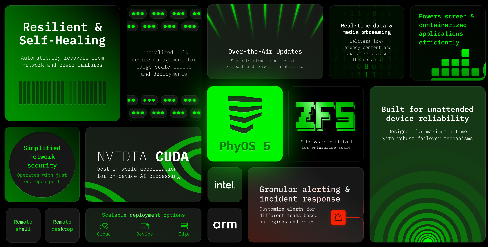

## 🚀 Designed for speed, scale, & simplicity

**Phygrid is the operating system for physical-world AI.**

We believe the next digital frontier isn't in the cloud. It's in the real world, where life happens. From intersections and warehouses to farmlands and ports, building for the physical world has been messy, fragmented, and slow. We're fixing it.

Phygrid is the infrastructure layer for real-world intelligence, turning edge devices into scalable systems, empowering developers to ship AI solutions in days, and making proof-of-concept to production a repeatable, capital-efficient playbook.

<PhyCard cover={<GatsbyImage src={props.images[1]} alt="PhyOS" />}>
 <Antd.Row gutter={[24,16]} style={{ width: "100%", marginTop: 'var(--ant-margin-md)', marginBottom: 'var(--ant-margin-md)' }} >

<Antd.Col xs={24} lg={12} xl={8}>
  

    <strong>Edge Native OS</strong>
     
    Hardened Linux-based operating system built specifically for edge
    deployments.
  

</Antd.Col>

<Antd.Col xs={24} lg={12} xl={8}>
  

    <strong>Centralized Management</strong>
     
    Seamlessly manage and monitor edge devices, AI models, peripherals &
    solutions from a single platform.
  

</Antd.Col>

<Antd.Col xs={24} lg={12} xl={8}>
  

    <strong>Seamless Integrations</strong>
     
    Connect with existing services like Stripe, Google Workspace, CMS platforms,
    or custom APIs to unify your workflows and extend platform capabilities.
  

</Antd.Col>

<Antd.Col xs={24} lg={12} xl={8}>
  

    <strong>Data-Driven Insights</strong>
     
    Consolidate data from all sources to unlock actionable intelligence and
    fine-tune models to increase accuracy.
  

</Antd.Col>

<Antd.Col xs={24} lg={12} xl={8}>
  

    <strong>Developer-Centric Tooling</strong>
     
    Build with ease using well-documented APIs, SDKs, and workflows
  

</Antd.Col>

<Antd.Col xs={24} lg={12} xl={8}>
  

    <strong>Pre-built solutions & AI models</strong>
  

  

    Accelerate development with a growing marketplace of ready-to-use
    components, integrations, and models.
  

</Antd.Col>

</Antd.Row>
</PhyCard>

⚙️ **Edge Native OS:** Hardened Linux-based operating system built specifically
for edge deployments.

🚀 **Centralized Management:** Seamlessly manage and monitor edge devices,
AI models, peripherals & solutions from a single platform.

🔌 **Seamless Integrations:** Connect with existing services like Stripe, Google Workspace, CMS platforms, or custom APIs to unify your workflows and extend platform capabilities.

📊 **Data-Driven Insights:** Consolidate data from all sources to unlock actionable intelligence and fine-tune models to increase accuracy.

👨‍💻 **Developer-Centric Tooling:** Build with ease using well-documented APIs, SDKs, and workflows

🛍️ **Prebuilt Solutions & AI Models:** Accelerate development with a growing marketplace of ready-to-use components, integrations, and models.

## 👩‍💻👨‍💻 Developer-first experience

<PhyCard style={{ marginBottom: "var(--ant-margin-md)" }} images={[props.images[0]]} stickyImage>

<h3>
  <strong>1. 🧰 Dev toolkit</strong>
</h3>

Use CLI, API, SDKs, or the Console to configure, deploy, and monitor everything—from infrastructure to user-facing experiences.

- **CLI**: One-command deployment, device provisioning, live log access
- **API & SDKs**: Automate everything with Node.js, Python, and direct API access
- **Console**: Configure apps, devices, media, users, and billing via GUI

<h3 style={{ marginTop: "2em" }}>
  <strong>2. 🧱 Powerful backend stack</strong>
</h3>

A powerful backend stack with built-in services for orchestration, identity, content, and data.

- **Core API**: Unified interface for managing all backend services
- **Digital Twin Engine**: Model and control devices, apps, and peripherals
- **Signals + ML Ops**: Real-time data collection, model tuning, and automation
- **Products, Media, Checkout, ID Provider**: Support commerce, content, and identity workflows

<h3 style={{ marginTop: "2em" }}>
  <strong>3. 🛍️ Solutions marketplace</strong>
</h3>

Browse ready-to-use integrations, AI models, and edge workflows to accelerate development.

- Use prebuilt agents, hardware descriptors, and templates to deploy faster
- Build your own private or public listings for your organization or customers

<h3 style={{ marginTop: "2em" }}>
  <strong>4. 🧠 Edge native OS</strong>
</h3>

**PhyOS** is a hardened Linux-based OS for edge devices—container-ready, secure, and built for scale.

- Zero-touch provisioning and OTA updates
- GPU-accelerated container runtime
- Operational alerting and rollback support
- Runs on Intel, ARM, and custom hardware

<h3 style={{ marginTop: "2em" }}>
  <strong>5. 🗺️ Spaces</strong>
</h3>

Organize devices and apps by real-world hierarchy: region → building → floor → room

- Used to scope permissions, content targeting, analytics, and alerts
- Spaces are not digital twins themselves, but help structure how twins are deployed

<h3 style={{ marginTop: "2em" }}>
  <strong>6. 🔌 Peripherals</strong>
</h3>

Connect external hardware (scanners, doors, printers, etc.) via digital twin mapping.

- Control peripherals from apps, agents, or Console
- Supports bidirectional interaction, real-time data, and monitoring
- Works across screen-based and headless environments

</PhyCard>

## ⚡️ What Phygrid solves

Phygrid solves the complexity of building real-world applications that run across edge devices, screens, sensors, and connected environments. Without stitching together fragile stacks or managing infrastructure manually. Whether you're orchestrating devices, collecting signals, integrating peripherals, or deploying AI at the edge, Phygrid handles the hard parts so you can focus on building.

### ✅ Set up and maintain edge devices

Use **PhyOS** to skip manual setup, driver mess, flaky updates, and unresponsive devices.

<PhyCard style={{ marginBottom: "var(--ant-margin-md)" }}>

💡 **Zero-Touch Provisioning & Remote Management:** Provision using a 6 digit code (like a chromecast) or using device serial numbers for provisioning multiple devices at scale. Manage devices via intuitive Web UI, secure shell access, or full Remote Desktop control.

🧠 **Hardware-Accelerated Container Runtime:** Native support for GPU-acceleration (Nvidia, AMD and Intel) for high-performance, low-latency applications and agentic workflows making decisions directly at the edge.

🖥️ **Cross-Platform Hardware Support:** Runs reliably on both Intel and ARM-based hardware, making it suitable for a wide range of embedded and commercial-grade computing devices.

🔄 **OTA Updates With Rollback:** Robust over-the-air update system with version control and rollback support to ensure safe and reliable updates in production environments.

🚨 **Operational Alerts:** Define alert conditions and recipient groups. Trigger based on connectivity, event sequences (or lack thereof) and alert different recipients depending on physical location.

</PhyCard>

### ✅ Manage devices at scale

At the heart of Phygrid is **Phyhub**. The high-performance, cloud-native Digital Twin backend that powers intelligent device orchestration, real-time communication, and secure remote control at scale.

<PhyCard style={{ marginBottom: "var(--ant-margin-md)" }}>

🧭 **Digital Twins:** Track and manage devices, apps, peripherals and physical spaces using digital twins for full visibility and control.

🔔 **Real-Time Messaging:** Facilitate low-latency communication between apps, devices & peripherals, both locally and across the cloud.

🔐 **Perform Secure, Full Remote Management:** Access logs, update configurations, restart services, and more. All remotely, securely, and instantly.

🧬 **Custom Descriptors:** Create descriptors for your bespoke digital twins to make your applications and agents understand and interact with your unique physical environment.

🧠 **Model Context Protocol:** By exposing all Phyhub digital twins using MCP, you enable agentic workflows across all your physical spaces.

</PhyCard>

### ✅ Deploy, monitor, and control from one place

Use the **Phygrid Console** to manage your entire environment through a single UI.

<PhyCard style={{ marginBottom: "var(--ant-margin-md)" }}>

🚀 **App Management:** Install your own applications or applications from the marketplace to a single or thousand devices. Set a global configuration and overrides per physical location or device.

🖥️ **Device Management:** Configure, group, and control physical devices, from screens and sensors to any kind of peripheral.

🗺️ **Spaces & Physical Mapping:** Map devices to real-world locations and organize them into logical spaces for easier control and reporting.

📊 **Analytics & Data Collection:** Explore insights from edge-generated data, including system usage, performance, and user behavior.

🎞️ **Media & Content:** Organize and distribute media assets and contextual information for digital experiences on screens or mobile devices.

👨‍💼 **User & Role Management:** Manage your users, create custom roles, manage access to applications and physical spaces.

💳 **Usage & Billing:** Track platform usage and manage billing plans, quotas, and allowances.

</PhyCard>

### ✅ Track events and power automation

**Signals** is the data layer of the Phygrid platform. Powering insights, analytics, and adaptive experiences across all connected apps and environments.

<PhyCard style={{ marginBottom: "var(--ant-margin-md)" }}>

📈 **Historical Event Logging:** Log and analyze events from all connected devices and applications.

🧪 **ML Ops Support:** Use real-world data to measure outcomes, fine-tune models, and improve behavior over time.

🔄 **Real-Time Feeds & Integrations:** Stream data to external dashboards or subscribe to feeds for custom workflows.

</PhyCard>

### ✅ Automate and integrate with code

Use the CLI, API, and SDKs to deploy apps, manage devices, and automate your workflows.

<PhyCard style={{ marginBottom: "var(--ant-margin-md)" }}>

⚙️ **CLI with One-Command Deploys:** Deploy containers, apps, or config updates to thousands of devices at once.

📦 **SDKs for Node.js and Python:** Build native integrations or apps using familiar tooling.

🧪 **Test & Simulate Locally:** Develop against local emulators or staged devices before rolling out.

</PhyCard>

### ✅ Networking made easy

Phygrid-powered devices support flexible and secure networking options, designed for reliable deployment across diverse environments and enterprise networks.

<PhyCard style={{ marginBottom: "var(--ant-margin-md)" }}>

🛜 **Wired or Wireless Connectivity:** Depending on the hardware and deployment context, devices can connect via Ethernet, Wi-Fi or 4G/5G networks.

📤 **Outbound-Only Communication:** Devices initiate only outbound connections. Only a single IP and port needs whitelisting to streamline deployment to enterprise networks.

🔒 **Secure Protocols Only:** All communication is encrypted using industry-standard protocols WSS and HTTPS.

⚙️ **Flexible IP Configuration:** Supports both DHCP and Static IP address configurations, allowing seamless adaptation to existing network setups.

</PhyCard>

### ✅ Build end-to-end applications

Use **Phygrid's app framework** to connect logic, UI, and automation across your entire environment.

<PhyCard style={{ marginBottom: "var(--ant-margin-md)" }}>

🧠 **Edge Apps:** Run containers on devices for low-latency, hardware-integrated logic.

🖥️ **Screen Apps:** Build UIs with HTML5 and React for kiosk or signage deployments.

📱 **Progressive Web Apps (PWA):** Deliver mobile-friendly experiences through QR code or NFC—no installation needed.

☁️ **Cloud Apps:** Orchestrate and integrate from the cloud with access to all your device and space context.

</PhyCard>

### ✅ Data privacy

Phygrid is built with privacy and regulatory compliance at its core, ensuring trust and transparency across all deployments.

<PhyCard style={{ marginBottom: "var(--ant-margin-md)" }}   >

🛡️ Data Controller/Processor Model: Clients act as the Data Controller, while Phygrid operates as the Data Processor.

🆔 **Single Unified Record with Anonymized Contact ID:** All apps use a shared anonymized identifier, allowing for centralized consent management and easy withdrawal of consent.

🌍 **Global Data Residency Options:** Choose where your data is stored and processed — currently supported regions include EU, US, AU, IN, and UAE.

🔐 **End-to-End Encryption:** All data is encrypted in transit and at rest, ensuring protection across the entire lifecycle.

</PhyCard>

This model gives organizations the flexibility to meet local regulations, uphold user trust, and maintain full data governance across their solutions.

## 🏆 Why Phygrid?

✅ Cloud/Edge based
✅ AI Enhanced
✅ Composable
✅ Secure & compliant
✅ Great developer experience

One platform for everything physical in digital spaces. No one else comes close.

### 🔍 Us vs them

<table>
  <thead>
    <tr>
      <th>Feature</th>
      <th align="center">Phygrid</th>
      <th align="center">AWS Greengrass</th>
      <th align="center">Azure IoT Edge</th>
      <th align="center">Balena</th>
      <th align="center">NVIDIA Fleet</th>
    </tr>
  </thead>
  <tbody>
    <tr>
      <td>Multi-arch support</td>
      <td align="center">✅</td>
      <td align="center">✅</td>
      <td align="center">✅</td>
      <td align="center">✅</td>
      <td align="center">🟡</td>
    </tr>
    <tr>
      <td>GPU acceleration</td>
      <td align="center">✅</td>
      <td align="center">🟡</td>
      <td align="center">🟡</td>
      <td align="center">🟡</td>
      <td align="center">🟡</td>
    </tr>
    <tr>
      <td>ML framework support</td>
      <td align="center">✅</td>
      <td align="center">🟡</td>
      <td align="center">🟡</td>
      <td align="center">🟡</td>
      <td align="center">🟡</td>
    </tr>
    <tr>
      <td>OS &amp; device management</td>
      <td align="center">✅</td>
      <td align="center">🟡</td>
      <td align="center">🟡</td>
      <td align="center">✅</td>
      <td align="center">🟡</td>
    </tr>
    <tr>
      <td>Application management</td>
      <td align="center">✅</td>
      <td align="center">🟡</td>
      <td align="center">🟡</td>
      <td align="center">🟡</td>
      <td align="center">🟡</td>
    </tr>
    <tr>
      <td>Employee / visitor UI/UX</td>
      <td align="center">✅</td>
      <td align="center">❌</td>
      <td align="center">❌</td>
      <td align="center">❌</td>
      <td align="center">❌</td>
    </tr>
    <tr>
      <td>MLOps</td>
      <td align="center">✅</td>
      <td align="center">🟡</td>
      <td align="center">❌</td>
      <td align="center">❌</td>
      <td align="center">🟡</td>
    </tr>
    <tr>
      <td>Peripheral management</td>
      <td align="center">✅</td>
      <td align="center">❌</td>
      <td align="center">🟡</td>
      <td align="center">❌</td>
      <td align="center">❌</td>
    </tr>
    <tr>
      <td>MCP / LLMs environment interactions</td>
      <td align="center">✅</td>
      <td align="center">❌</td>
      <td align="center">❌</td>
      <td align="center">❌</td>
      <td align="center">❌</td>
    </tr>
    <tr>
      <td>Analytics &amp; dashboards</td>
      <td align="center">✅</td>
      <td align="center">❌</td>
      <td align="center">❌</td>
      <td align="center">❌</td>
      <td align="center">🟡</td>
    </tr>
    <tr>
      <td>Access management (location)</td>
      <td align="center">✅</td>
      <td align="center">❌</td>
      <td align="center">❌</td>
      <td align="center">❌</td>
      <td align="center">❌</td>
    </tr>
    <tr>
      <td>Resilient Edge Network stack</td>
      <td align="center">✅</td>
      <td align="center">❌</td>
      <td align="center">❌</td>
      <td align="center">❌</td>
      <td align="center">❌</td>
    </tr>
  </tbody>
</table>

## 🧰 Start building

- One-command deployments to thousands of devices
- Support for Node.js, Python, and containerized apps
- Tools for testing, alerts, remote access, and live debugging
- Open-source templates to get started fast
- Everything accessible via CLI, API, or Console

Head to the **Getting started** section to:

1. [Set up your tenant](../getting-started/tenant-setup)
2. [Set up your local environment](../getting-started/local-environment-setup)
3. [Deploy your first device](../getting-started/device-setup)
