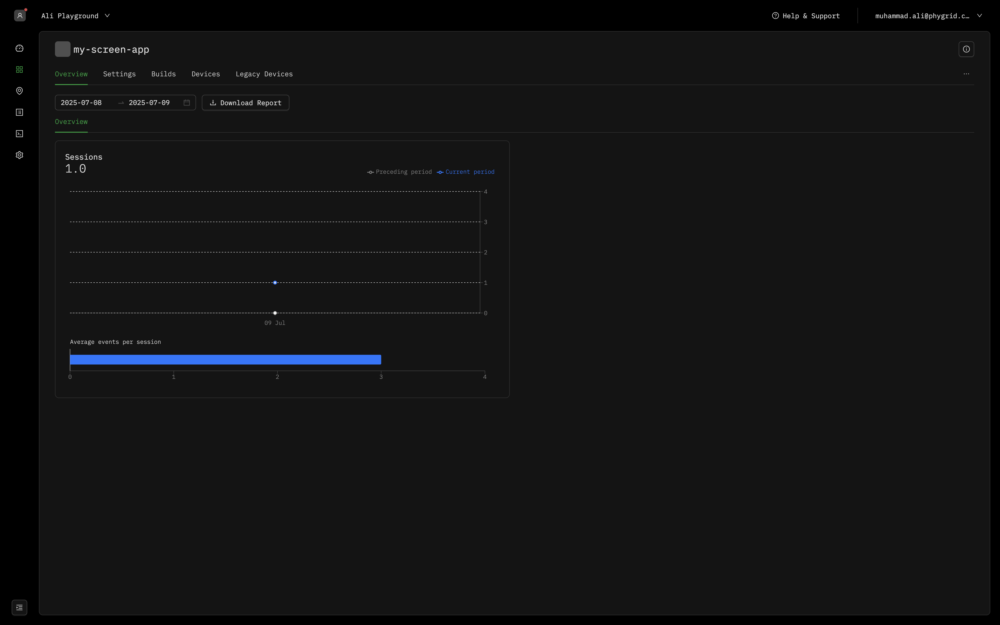
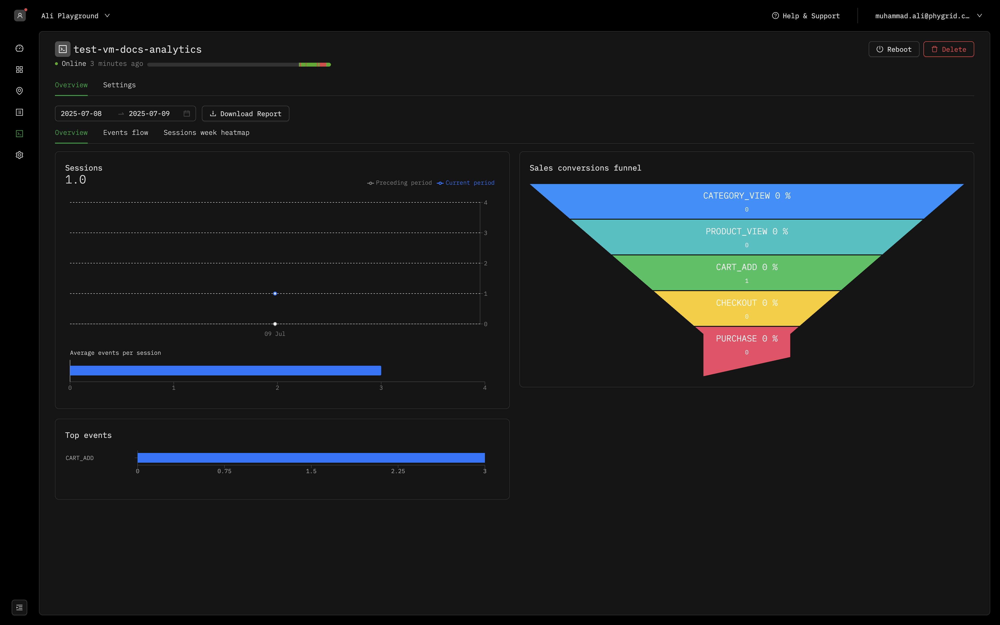
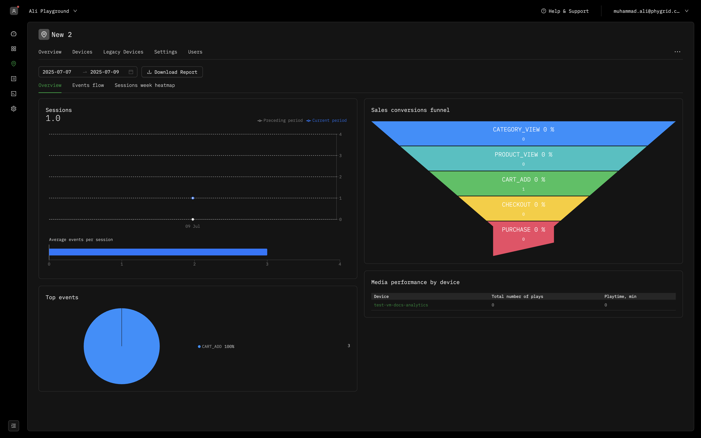
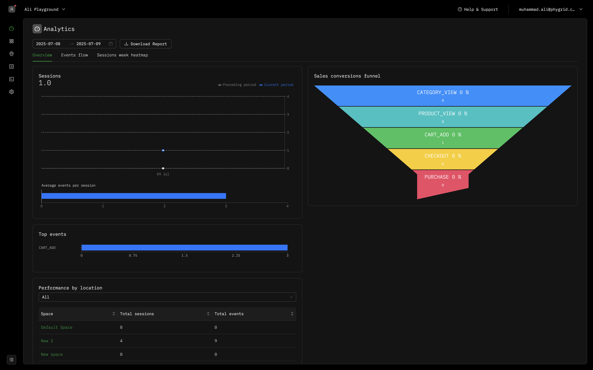
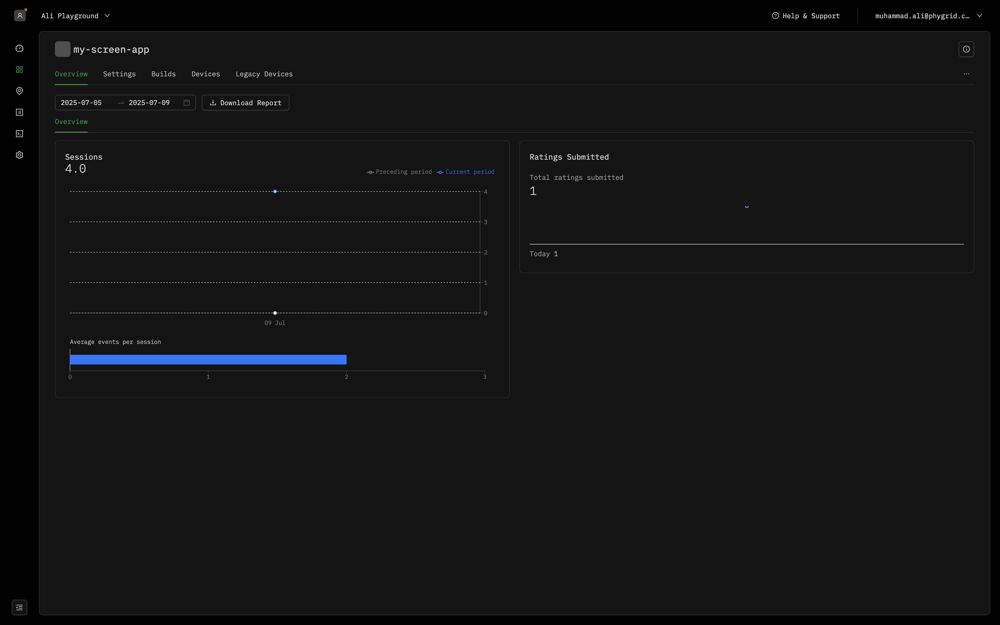

This comprehensive guide demonstrates how to configure and customize analytics dashboards and reports for your Phygrid applications. You'll learn how to set up analytics schemas, track custom events, and visualize data across multiple organizational levels.

Reports and analytics provide valuable insights into user interactions, app performance, and business metrics. By implementing custom analytics schemas, you can track specific events relevant to your use case and display meaningful data visualizations in the Phygrid Console.

**After completing this guide, you should understand:**

- How to configure analytics schemas for your Screen Apps
- The four levels of report aggregation available in the platform
- How to implement custom event tracking for business metrics
- Best practices for creating meaningful analytics dashboards
- How to visualize custom events in the Console's reporting interface

## 🎯 Analytics Schema Overview

The **analytics schema** defines the structure and types of data visualizations displayed in your application's dashboard. Screen Apps include a default analytics schema that can be customized to track specific events and metrics relevant to your business needs.

**Default Analytics Configuration:**

All new Screen Apps include a basic analytics schema located in `src/analytics-schema.ts`. The default configuration provides session tracking:

```ts
const analyticsSchema: AnalyticsSchema = {
  groups: [
    {
      name: "Overview",
      cards: [
        {
          type: CardType.Sessions,
          interactionType: SessionInteractionType.Interactive,
        },
      ],
    },
  ],
}
```

**Key Benefits:**

- **Real-time Analytics:** Monitor user interactions and app performance in real-time
- **Multi-level Reporting:** View aggregated data across installations, devices, spaces, and tenants
- **Custom Event Tracking:** Track specific business metrics and user behaviors
- **Visual Dashboards:** Generate professional charts and visualizations automatically

## 📋 Available Card Types

The analytics schema supports multiple card types, each designed for specific data visualization needs. Understanding these card types enables you to create comprehensive dashboards that effectively communicate your application's performance metrics.

### **Basic Analytics Cards**

#### **Sessions Card**

Tracks user session data and interaction patterns.

```ts
interface SessionsCard extends BaseCard {
  type: CardType.Sessions
  interactionType?: SessionInteractionType
}

enum SessionInteractionType {
  Interactive = "interactive",
  All = "all",
}
```

**Example Configuration:**

```ts
{
  type: CardType.Sessions,
  interactionType: SessionInteractionType.Interactive,
}
```

**Use Cases:**

- Monitor active user sessions
- Track user engagement duration
- Analyze session frequency patterns

#### **Events List Card**

Displays a chronological list of recent events.

```ts
interface EventsListCard extends BaseCard {
  type: CardType.EventsList
  interactionType?: InteractionType
}

enum InteractionType {
  Interactive = "interactive",
  NonInteractive = "nonInteractive",
  All = "all",
}
```

**Example Configuration:**

```ts
{
  type: CardType.EventsList,
  interactionType: InteractionType.Interactive,
}
```

**Use Cases:**

- Monitor real-time event streams
- Debug application behavior
- Track user interaction sequences

#### **Events Count Card**

Counts occurrences of specific event types within a time period.

```ts
interface EventsCount extends BaseCard {
  type: CardType.EventsCount
  title: string
  eventType: string
}
```

**Example Configuration:**

```ts
{
  type: CardType.EventsCount,
  title: "Ratings Count",
  eventType: "RATING",
}
```

**Use Cases:**

- Track feature usage frequency
- Monitor user engagement metrics
- Measure conversion rates

### **Advanced Analytics Cards**

#### **Events Flow Card**

Visualizes the sequence and flow of user events through your application.

```ts
interface EventsFlowCard extends BaseCard {
  type: CardType.EventsFlow
}
```

**Example Configuration:**

```ts
{
  type: CardType.EventsFlow,
}
```

**Use Cases:**

- Analyze user journey paths
- Identify drop-off points
- Optimize user experience flow

#### **Events Funnel Card**

Tracks conversion rates through a defined sequence of events.

```ts
interface EventsFunnelCard extends BaseCard {
  type: CardType.EventsFunnel
  title: string
  events: string[]
}
```

**Example Configuration:**

```ts
{
  type: CardType.EventsFunnel,
  title: "Purchase Funnel",
  events: ["CART_ADD", "CART_REMOVE", "CART_VIEW"],
}
```

**Use Cases:**

- Measure conversion funnels
- Identify bottlenecks in user flows
- Track multi-step process completion

#### **Week Heatmap Card**

Shows activity patterns across days and hours of the week.

```ts
interface WeekHeatmapCard extends BaseCard {
  type: CardType.WeekHeatmap
  title: string
  dataSource: WeekHeatmapDataSourceSessions | WeekHeatmapDataSourceEvents
}

enum WeekHeatmapDataSourceType {
  Sessions = "Sessions",
  Events = "Events",
}

interface WeekHeatmapDataSourceSessions extends WeekHeatmapDataSource {
  type: WeekHeatmapDataSourceType.Sessions
  interactionType?: SessionInteractionType
}

interface WeekHeatmapDataSourceEvents extends WeekHeatmapDataSource {
  type: WeekHeatmapDataSourceType.Events
  eventType: string
}
```

**Example Configuration:**

```ts
{
  type: CardType.WeekHeatmap,
  title: "Content View Heatmap",
  dataSource: {
    type: WeekHeatmapDataSourceType.Events,
    eventType: "CONTENT_VIEW",
  },
}
```

**Use Cases:**

- Identify peak usage times
- Optimize resource allocation
- Plan maintenance windows

### **Business Intelligence Cards**

#### **Net Promoter Score (NPS) Card**

Measures customer satisfaction and loyalty metrics.

```ts
interface NpsCard extends BaseCard {
  type: CardType.Nps
}
```

**Example Configuration:**

```ts
{
  type: CardType.Nps,
}
```

**Use Cases:**

- Track customer satisfaction
- Monitor service quality
- Measure brand loyalty

#### **Products Event Count Card**

Analyzes product-specific event occurrences.

```ts
interface ProductsEventCountCard extends BaseCard {
  type: CardType.ProductsEventCount
  eventType: string
  title: string
}
```

**Example Configuration:**

```ts
{
  type: CardType.ProductsEventCount,
  eventType: "PRODUCT_VIEW",
  title: "Product Views",
}
```

**Use Cases:**

- Track product performance
- Monitor inventory interaction
- Analyze product popularity

#### **Categories Event Count Card**

Tracks events across product categories.

```ts
interface CategoriesEventCountCard extends BaseCard {
  type: CardType.CategoriesEventCount
}
```

**Example Configuration:**

```ts
{
  type: CardType.CategoriesEventCount,
}
```

**Use Cases:**

- Analyze category performance
- Monitor section engagement
- Track departmental metrics

### **E-commerce Analytics Cards**

#### **Cart Count Card**

Monitors shopping cart metrics and abandonment rates.

```ts
interface CartCountCart extends BaseCard {
  type: CardType.CartCount
}
```

**Example Configuration:**

```ts
{
  type: CardType.CartCount,
}
```

**Use Cases:**

- Track cart abandonment
- Monitor checkout initiation
- Analyze purchase intent

#### **Checkout Summary Card**

Provides comprehensive checkout and transaction analytics.

```ts
interface CheckoutSummary extends BaseCard {
  type: CardType.CheckoutSummary
}
```

**Example Configuration:**

```ts
{
  type: CardType.CheckoutSummary,
}
```

**Use Cases:**

- Monitor transaction success rates
- Track payment method usage
- Analyze checkout completion

### **Monitoring and Status Cards**

#### **Monitoring Realtime Status Card**

Displays real-time system status and health metrics.

```ts
interface MonitoringRealtimeStatus extends BaseCard {
  type: CardType.MonitoringRealtimeStatus
  eventType: string
  distinctColumns: RealtimeStatusDistinctEventColumnType[]
  title: string
  statusReference?: Record<
    string | number,
    {
      label: string
      color: string
    }
  >
}

type RealtimeStatusDistinctEventColumnType =
  | "str1"
  | "str2"
  | "str3"
  | "str4"
  | "str5"
  | "int1"
  | "int2"
  | "int3"
  | "int4"
  | "int5"
  | "deviceId"
```

**Example Configuration:**

```ts
{
  type: CardType.MonitoringRealtimeStatus,
  eventType: "DEVICE_STATUS",
  distinctColumns: ["deviceId", "str1"],
  title: "Device Status Monitor",
  statusReference: {
    online: { label: "Online", color: "#22c55e" },
    offline: { label: "Offline", color: "#ef4444" },
    warning: { label: "Warning", color: "#f59e0b" },
  },
}
```

**Use Cases:**

- Monitor device health
- Track system performance
- Alert on status changes

#### **Monitoring Status History Card**

Shows historical status changes and trends over time.

```ts
interface MonitoringStatusHistory extends BaseCard {
  type: CardType.MonitoringStatusHistory
  eventType: string
  title: string
  statusReference?: Record<
    string | number,
    {
      label: string
      color: string
    }
  >
}
```

**Example Configuration:**

```ts
{
  type: CardType.MonitoringStatusHistory,
  eventType: "SYSTEM_STATUS",
  title: "System Status History",
  statusReference: {
    1: { label: "Healthy", color: "#22c55e" },
    2: { label: "Degraded", color: "#f59e0b" },
    3: { label: "Down", color: "#ef4444" },
  },
}
```

**Use Cases:**

- Track system uptime
- Analyze performance trends
- Monitor service reliability

### **Grid Layout and Styling**

All cards support advanced grid layout customization through the `gridStyles` property:

```ts
type GridStylesKey =
  | "grid"
  | "grid-area"
  | "grid-auto-columns"
  | "grid-auto-flow"
  | "grid-auto-rows"
  | "grid-column"
  | "grid-column-end"
  | "grid-column-gap"
  | "grid-column-start"
  | "grid-gap"
  | "grid-row"
  | "grid-row-end"
  | "grid-row-gap"
  | "grid-row-start"
  | "grid-template"
  | "grid-template-areas"
  | "grid-template-columns"
  | "grid-template-rows"

interface GridStyles {
  [key in GridStylesKey]?: string | number
}
```

**Example with Custom Layout:**

```ts
{
  type: CardType.Sessions,
  interactionType: SessionInteractionType.Interactive,
  gridStyles: {
    "grid-column": "span 2",
    "grid-row": "span 1",
  },
}
```

## 📊 Report Aggregation Levels

The Phygrid platform provides analytics and reports at four distinct organizational levels, enabling you to analyze data from different perspectives and scopes:

### 1. Installation Level Reports

View analytics specific to individual app installations, providing detailed insights into single deployment performance and user interactions.



**Use Cases:**

- Monitor performance of specific app deployments
- Track user engagement for individual installations
- Analyze installation-specific metrics and events

### 2. Device Level Reports

Access analytics for individual devices, showing aggregated data from all apps and services running on a specific device.



**Use Cases:**

- Monitor device performance and health
- Track cross-app interactions on single devices
- Analyze device-specific usage patterns

### 3. Space Level Reports

View aggregated analytics for all devices and installations within a specific space or location.



**Use Cases:**

- Monitor location-based performance metrics
- Track foot traffic and engagement across spaces
- Analyze space-wide user behavior patterns

### 4. Tenant Level Reports

Access comprehensive analytics aggregated across all devices, installations, and spaces within your entire tenant.



**Use Cases:**

- Monitor organization-wide performance metrics
- Track global user engagement and trends
- Generate executive-level reporting and insights

## 🛠️ How to Implement Custom Event Tracking

This section demonstrates how to implement custom event tracking using a product rating system as an example. You'll learn how to create user interface elements, emit custom events, and configure analytics to display the tracked data.

### **Step 1: Create User Interface Components**

First, implement the UI components that will collect user input and trigger custom events. Add the following state management and event handler to your Screen App:

```ts
const [selectedRating, setSelectedRating] = useState<1 | 2 | 3 | 4 | 5>(5)

const handleSendRating = useCallback(() => {
  const { signals } = state
  if (!signals) return

  signals.sendRating({
    rating: selectedRating,
  })
}, [state, selectedRating])
```

**Key Components:**

- **State Management:** Track user's selected rating value
- **Event Handler:** Emit custom events when ratings are submitted
- **Signals Integration:** Use the signals client to send events to the platform

### **Step 2: Add Rating Interface Elements**

Include the rating interface in your app's main component by adding the following JSX elements:

```tsx
<RatingSection>
  <p>Rate this product:</p>
  <StarRating>
    {([1, 2, 3, 4, 5] as const).map(star => (
      <Star
        key={star}
        filled={star <= selectedRating}
        onClick={() => setSelectedRating(star)}
      >
        ★
      </Star>
    ))}
  </StarRating>
  <StyledButton onClick={handleSendRating}>
    Send Rating ({selectedRating} star{selectedRating !== 1 ? "s" : ""})
  </StyledButton>
</RatingSection>
```

**Interface Features:**

- **Interactive Stars:** Users can click to select their rating
- **Visual Feedback:** Selected stars are highlighted differently
- **Submit Button:** Clearly indicates the selected rating before submission

### **Step 3: Apply Custom Styling**

Add the following styled components to create a polished user interface:

```ts
const RatingSection = styled.div`
  display: flex;
  flex-direction: column;
  align-items: center;
  margin-top: 20px;
`

const StarRating = styled.div`
  display: flex;
  gap: 5px;
  margin: 10px 0;
`

const Star = styled.span<{ filled: boolean }>`
  font-size: 30px;
  color: ${props => (props.filled ? "#FFD700" : "#555")};
  cursor: pointer;
  transition: color 0.2s ease;
  user-select: none;

  &:hover {
    color: #ffd700;
  }
`
```

**Styling Features:**

- **Responsive Design:** Centered layout with appropriate spacing
- **Visual Hierarchy:** Clear distinction between filled and unfilled stars
- **Interactive Elements:** Hover effects and smooth transitions
- **Accessibility:** Proper cursor states and user-select properties

### **Step 4: Configure Analytics Schema**

Update your `analytics-schema.ts` file to include the custom event tracking configuration:

```ts
const analyticsSchema: AnalyticsSchema = {
  groups: [
    {
      name: "Overview",
      cards: [
        {
          type: CardType.Sessions,
          interactionType: SessionInteractionType.Interactive,
        },
        {
          type: CardType.EventsCount,
          title: "Ratings Submitted",
          eventType: "RATING",
        },
      ],
    },
  ],
}
```

**Configuration Details:**

- **Event Counting:** Track the total number of rating submissions
- **Custom Title:** Display meaningful labels in the dashboard
- **Event Type Filtering:** Specify which events to include in the visualization

### **Step 5: Deploy and Test**

After implementing the custom event tracking, follow these steps to deploy and validate your changes:

1. **Build the Updated App:**

   ```bash
   yarn build
   ```

2. **Deploy to Your Tenant:**

   ```bash
   phy app push
   ```

3. **Test the Rating Interface:**
   - Navigate to your deployed Screen App
   - Interact with the rating interface to generate events
   - Verify that ratings are submitted successfully


4. **Monitor Analytics Dashboard:**
   - Allow 24 hours for analytics processing
   - Check the Console for updated dashboard metrics
   - Verify that rating events appear in the reports



**Expected Results:**

- Rating interface appears and functions correctly on the device
- User interactions generate custom events that are tracked
- Analytics dashboard displays the new "Ratings Submitted" metric
- Data aggregation occurs at all organizational levels

## 🔄 Next Steps

Now that you understand reports and analytics, you can:

- [Learn about Signals for advanced event tracking](/how-to/signals/)
- [Explore Products Integration for e-commerce analytics](/how-to/products-integration/)
- [Implement Checkout Integration for transaction tracking](/how-to/checkout-integration/)
- [Review the API Reference for advanced reporting capabilities](/api-reference/reports-api/)

## 📚 Additional Resources

- **Analytics Schema Types:** Explore all available card types and configuration options
- **Event Processing:** Learn about event lifecycle and processing timelines
- **Performance Optimization:** Best practices for efficient event tracking
- **Troubleshooting:** Common issues and solutions for analytics implementation
