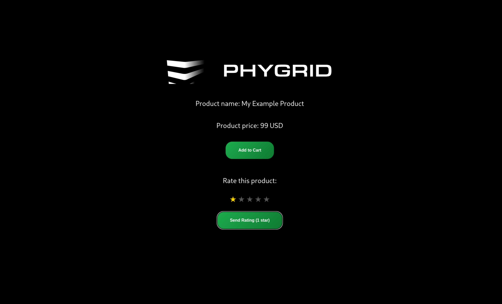

This comprehensive guide demonstrates how to configure and customize analytics dashboards and reports for your PhyStack applications. You'll learn how to set up analytics schemas, track custom events, and visualize data across multiple organizational levels.

**After completing this guide, you should understand:**

- How to configure analytics schemas for your Screen Apps
- The four levels of report aggregation available in the platform
- How to implement custom event tracking for business metrics
- Best practices for creating meaningful analytics dashboards
- How to visualize custom events in the Console's reporting interface

## **⚙️ What Are Reports?**

Reports and analytics provide valuable insights into user interactions, app performance, and business metrics. By implementing custom analytics schemas, you can track specific events relevant to your use case and display meaningful data visualizations in the PhyStack Console.

## 🛠️ How to Implement Analytics

This section demonstrates how to create reports for [signals](/how-to/signals/) using a product rating system as an example.
You'll learn how to create user interface elements, emit events, and configure analytics to display the tracked data.

### **Screen App Analytics Example**

If you don't have a screen app project yet, you can create one by following the [Build your first screen app](/tutorials/build-your-first-screen-app/) tutorial.
All new Screen Apps and Edge Apps include a basic analytics schema located in `src/analytics-schema.ts`. The **analytics schema** defines the structure and types of data visualizations displayed in your application's dashboard. Screen Apps include
a default analytics schema that can be customized to track specific events and metrics relevant to your business needs. The default configuration provides session tracking:

```ts
const analyticsSchema: AnalyticsSchema = {
  groups: [
    {
      name: "Overview",
      cards: [
        {
          type: CardType.Sessions,
          interactionType: SessionInteractionType.Interactive,
        },
      ],
    },
  ],
}
```

### **Step 1: Create User Interface Components**

First, implement the UI components that will collect user input and trigger custom events. Add the following state management and event handler to your Screen App:

```ts
const [selectedRating, setSelectedRating] = useState<1 | 2 | 3 | 4 | 5>(5)

const handleSendRating = useCallback(() => {
  const { signals } = state
  if (!signals) return

  signals.sendRating({
    rating: selectedRating,
  })
}, [state, selectedRating])
```

**Key Components:**

- **State Management:** Track user's selected rating value
- **Event Handler:** Emit custom events when ratings are submitted
- **Signals Integration:** Use the signals client to send events to the platform

### **Step 2: Add Rating Interface Elements**

Include the rating user interface in your app's main component by adding the following JSX elements:

```tsx
<RatingSection>
  <p>Rate this product:</p>
  <StarRating>
    {([1, 2, 3, 4, 5] as const).map(star => (
      <Star
        key={star}
        filled={star <= selectedRating}
        onClick={() => setSelectedRating(star)}
      >
        ★
      </Star>
    ))}
  </StarRating>
  <StyledButton onClick={handleSendRating}>
    Send Rating ({selectedRating} star)
  </StyledButton>
</RatingSection>
```

### **Step 3: Apply Custom Styling**

Add the following styled components to create a polished user interface:

```ts
const RatingSection = styled.div`
  display: flex;
  flex-direction: column;
  align-items: center;
  margin-top: 20px;
`

const StarRating = styled.div`
  display: flex;
  gap: 5px;
  margin: 10px 0;
`

const Star = styled.span<{ filled: boolean }>`
  font-size: 30px;
  color: ${props => (props.filled ? "#FFD700" : "#555")};
  cursor: pointer;
  transition: color 0.2s ease;
  user-select: none;

  &:hover {
    color: #ffd700;
  }
`
```

### **Step 4: Configure Analytics Schema**

Update your `analytics-schema.ts` file to include the custom event tracking configuration:

```ts
const analyticsSchema: AnalyticsSchema = {
  groups: [
    {
      name: "Overview",
      cards: [
        {
          type: CardType.Sessions,
          interactionType: SessionInteractionType.Interactive,
        },
        {
          type: CardType.EventsCount,
          title: "Ratings Submitted",
          eventType: "RATING",
        },
      ],
    },
  ],
}
```

**Configuration Details:**

- **Event Counting:** Track the total number of rating submissions
- **Custom Title:** Display meaningful labels in the dashboard
- **Event Type Filtering:** Specify which events to include in the visualization

### **Step 5: Deploy and Test**

After implementing the custom event tracking, follow these steps to deploy and validate your changes:

1. **Build the Updated App:**

   ```bash
   phy app build
   ```

2. **Deploy to Your Tenant:**

   ```bash
   phy app publish
   ```

3. **Test the Rating Interface:**
   - Navigate to your deployed Screen App
   - Interact with the rating interface to generate events
   - Verify that ratings are submitted successfully



4. **Monitor Analytics Dashboard:**
   - Allow 24 hours for analytics processing
   - Check the Console for updated dashboard metrics
   - Verify that rating events appear in the reports


**Expected Results:**

- Rating interface appears and functions correctly on the device
- User interactions generate custom events that are tracked
- Analytics dashboard displays the new "Ratings Submitted" metric

**Note:** Analytics will appear after 24 hours

## 📋 Available Card Types

The analytics schema supports multiple card types, each designed for specific data visualization needs. Understanding these card types enables you to create comprehensive dashboards that effectively communicate your application's performance metrics.

### **Basic Analytics Cards**

#### **Sessions Card**

Tracks user session data and interaction patterns.

```ts
interface SessionsCard extends BaseCard {
  type: CardType.Sessions
  interactionType?: SessionInteractionType
}

enum SessionInteractionType {
  Interactive = "interactive",
  All = "all",
}
```

**Example Configuration:**

```ts
{
  type: CardType.Sessions,
  interactionType: SessionInteractionType.Interactive,
}
```

**Use Cases:**

- Monitor active user sessions
- Track user engagement duration
- Analyze session frequency patterns

#### **Events List Card**

Displays a chronological list of recent events.

```ts
interface EventsListCard extends BaseCard {
  type: CardType.EventsList
  interactionType?: InteractionType
}

enum InteractionType {
  Interactive = "interactive",
  NonInteractive = "nonInteractive",
  All = "all",
}
```

**Example Configuration:**

```ts
{
  type: CardType.EventsList,
  interactionType: InteractionType.Interactive,
}
```

**Use Cases:**

- Monitor real-time event streams
- Debug application behavior
- Track user interaction sequences

#### **Events Count Card**

Counts occurrences of specific event types within a time period.

```ts
interface EventsCount extends BaseCard {
  type: CardType.EventsCount
  title: string
  eventType: string
}
```

**Example Configuration:**

```ts
{
  type: CardType.EventsCount,
  title: "Ratings Count",
  eventType: "RATING",
}
```

**Use Cases:**

- Track feature usage frequency
- Monitor user engagement metrics
- Measure conversion rates

### **Advanced Analytics Cards**

#### **Events Flow Card**

Visualizes the sequence and flow of user events through your application.

```ts
interface EventsFlowCard extends BaseCard {
  type: CardType.EventsFlow
}
```

**Example Configuration:**

```ts
{
  type: CardType.EventsFlow,
}
```

**Use Cases:**

- Analyze user journey paths
- Identify drop-off points
- Optimize user experience flow

#### **Events Funnel Card**

Tracks conversion rates through a defined sequence of events.

```ts
interface EventsFunnelCard extends BaseCard {
  type: CardType.EventsFunnel
  title: string
  events: string[]
}
```

**Example Configuration:**

```ts
{
  type: CardType.EventsFunnel,
  title: "Purchase Funnel",
  events: ["CART_ADD", "CART_REMOVE", "CART_VIEW"],
}
```

**Use Cases:**

- Measure conversion funnels
- Identify bottlenecks in user flows
- Track multi-step process completion

#### **Week Heatmap Card**

Shows activity patterns across days and hours of the week.

```ts
interface WeekHeatmapCard extends BaseCard {
  type: CardType.WeekHeatmap
  title: string
  dataSource: WeekHeatmapDataSourceSessions | WeekHeatmapDataSourceEvents
}

enum WeekHeatmapDataSourceType {
  Sessions = "Sessions",
  Events = "Events",
}

interface WeekHeatmapDataSourceSessions extends WeekHeatmapDataSource {
  type: WeekHeatmapDataSourceType.Sessions
  interactionType?: SessionInteractionType
}

interface WeekHeatmapDataSourceEvents extends WeekHeatmapDataSource {
  type: WeekHeatmapDataSourceType.Events
  eventType: string
}
```

**Example Configuration:**

```ts
{
  type: CardType.WeekHeatmap,
  title: "Content View Heatmap",
  dataSource: {
    type: WeekHeatmapDataSourceType.Events,
    eventType: "CONTENT_VIEW",
  },
}
```

**Use Cases:**

- Identify peak usage times
- Optimize resource allocation
- Plan maintenance windows

### **Business Intelligence Cards**

#### **Net Promoter Score (NPS) Card**

Measures customer satisfaction and loyalty metrics.

```ts
interface NpsCard extends BaseCard {
  type: CardType.Nps
}
```

**Example Configuration:**

```ts
{
  type: CardType.Nps,
}
```

**Use Cases:**

- Track customer satisfaction
- Monitor service quality
- Measure brand loyalty

#### **Products Event Count Card**

Analyzes product-specific event occurrences.

```ts
interface ProductsEventCountCard extends BaseCard {
  type: CardType.ProductsEventCount
  eventType: string
  title: string
}
```

**Example Configuration:**

```ts
{
  type: CardType.ProductsEventCount,
  eventType: "PRODUCT_VIEW",
  title: "Product Views",
}
```

**Use Cases:**

- Track product performance
- Monitor inventory interaction
- Analyze product popularity

#### **Categories Event Count Card**

Tracks events across product categories.

```ts
interface CategoriesEventCountCard extends BaseCard {
  type: CardType.CategoriesEventCount
}
```

**Example Configuration:**

```ts
{
  type: CardType.CategoriesEventCount,
}
```

**Use Cases:**

- Analyze category performance
- Monitor section engagement
- Track departmental metrics

### **E-commerce Analytics Cards**

#### **Cart Count Card**

Monitors shopping cart metrics and abandonment rates.

```ts
interface CartCountCart extends BaseCard {
  type: CardType.CartCount
}
```

**Example Configuration:**

```ts
{
  type: CardType.CartCount,
}
```

**Use Cases:**

- Track cart abandonment
- Monitor checkout initiation
- Analyze purchase intent

#### **Checkout Summary Card**

Provides comprehensive checkout and transaction analytics.

```ts
interface CheckoutSummary extends BaseCard {
  type: CardType.CheckoutSummary
}
```

**Example Configuration:**

```ts
{
  type: CardType.CheckoutSummary,
}
```

**Use Cases:**

- Monitor transaction success rates
- Track payment method usage
- Analyze checkout completion

### **Monitoring and Status Cards**

#### **Monitoring Realtime Status Card**

Displays real-time system status and health metrics.

```ts
interface MonitoringRealtimeStatus extends BaseCard {
  type: CardType.MonitoringRealtimeStatus
  eventType: string
  distinctColumns: RealtimeStatusDistinctEventColumnType[]
  title: string
  statusReference?: Record<
    string | number,
    {
      label: string
      color: string
    }
  >
}

type RealtimeStatusDistinctEventColumnType =
  | "str1"
  | "str2"
  | "str3"
  | "str4"
  | "str5"
  | "int1"
  | "int2"
  | "int3"
  | "int4"
  | "int5"
  | "deviceId"
```

**Example Configuration:**

```ts
{
  type: CardType.MonitoringRealtimeStatus,
  eventType: "DEVICE_STATUS",
  distinctColumns: ["deviceId", "str1"],
  title: "Device Status Monitor",
  statusReference: {
    online: { label: "Online", color: "#22c55e" },
    offline: { label: "Offline", color: "#ef4444" },
    warning: { label: "Warning", color: "#f59e0b" },
  },
}
```

**Use Cases:**

- Monitor device health
- Track system performance
- Alert on status changes

#### **Monitoring Status History Card**

Shows historical status changes and trends over time.

```ts
interface MonitoringStatusHistory extends BaseCard {
  type: CardType.MonitoringStatusHistory
  eventType: string
  title: string
  statusReference?: Record<
    string | number,
    {
      label: string
      color: string
    }
  >
}
```

**Example Configuration:**

```ts
{
  type: CardType.MonitoringStatusHistory,
  eventType: "SYSTEM_STATUS",
  title: "System Status History",
  statusReference: {
    1: { label: "Healthy", color: "#22c55e" },
    2: { label: "Degraded", color: "#f59e0b" },
    3: { label: "Down", color: "#ef4444" },
  },
}
```

**Use Cases:**

- Track system uptime
- Analyze performance trends
- Monitor service reliability

### **Grid Layout and Styling**

All cards support advanced grid layout customization through the `gridStyles` property:

```ts
type GridStylesKey =
  | "grid"
  | "grid-area"
  | "grid-auto-columns"
  | "grid-auto-flow"
  | "grid-auto-rows"
  | "grid-column"
  | "grid-column-end"
  | "grid-column-gap"
  | "grid-column-start"
  | "grid-gap"
  | "grid-row"
  | "grid-row-end"
  | "grid-row-gap"
  | "grid-row-start"
  | "grid-template"
  | "grid-template-areas"
  | "grid-template-columns"
  | "grid-template-rows"

interface GridStyles {
  [key in GridStylesKey]?: string | number
}
```

**Example with Custom Layout:**

```ts
{
  type: CardType.Sessions,
  interactionType: SessionInteractionType.Interactive,
  gridStyles: {
    "grid-column": "span 2",
    "grid-row": "span 1",
  },
}
```

## 📊 Analytics Aggregation Levels

The PhyStack platform provides analytics and reports at four distinct organizational levels, enabling you to analyze data from different perspectives and scopes:

### 1. Installation Level Reports

View analytics specific to individual app installations, providing detailed insights of signals captured from all the devices connected to the installation. Here you can fully customize the reports based on the `analytics-schema.ts` definition of your installation.


**Use Cases:**

- Monitor performance of specific app deployments
- Track user engagement for individual installations
- Analyze installation-specific metrics and events

### 2. Device Level Reports

Access comprehensive analytics for individual devices, providing consolidated insights and aggregated data from all apps, services, and user interactions occurring on a specific device.
Here you have three tabs available for analytics.

- 1. Overview
  - Sessions
  - Top events
  - Product views
  - Media performance
  - NPS responses
  - Sales conversions funnel
  - Category views
  - Media performance by tag
- 2. Events flow
- 3. Sessions week heatmap


**Use Cases:**

- Monitor device performance and health
- Track cross-app interactions on single devices
- Analyze device-specific usage patterns

### 3. Space Level Reports

Access comprehensive analytics aggregated across all devices and installations within a specific space or location, providing consolidated insights into location-based performance metrics, user engagement patterns, and cross-device interactions within the physical environment.

- 1. Overview
  - Sessions
  - Top events
  - Product views
  - Media performance by device
  - NPS responses
  - Sales conversions funnel
  - Category views
  - Media performance
  - Performance by device
- 2. Events flow
- 3. Sessions week heatmap


**Use Cases:**

- Monitor location-based performance metrics
- Track foot traffic and engagement across spaces
- Analyze space-wide user behavior patterns

### 4. Tenant Level Reports

Access comprehensive analytics aggregated across all devices, installations, and spaces within your entire tenant, providing organization-wide insights that enable executive-level decision making, strategic planning, and comprehensive performance monitoring across your entire PhyStack ecosystem.

Here you have three tabs available for analytics covering your complete organizational scope.

- 1. Overview
  - Sessions
  - Top events
  - Product views
  - Media performance
  - NPS responses
  - Sales conversions funnel
  - Category views
  - Media performance by tag
  - Performance by location
  - Performance by installation
- 2. Events flow
- 3. Sessions week heatmap


**Use Cases:**

- Monitor organization-wide performance metrics
- Track global user engagement and trends
- Generate executive-level reporting and insights

## 📅 Filter Analytics by Date

All analytics dashboards in the PhyStack platform include powerful date filtering capabilities that allow you to analyze data across specific time periods. The date range selector provides flexible options to view historical trends, compare performance across different periods, and focus on specific timeframes for detailed analysis.

**Available Date Range Options:**

- **Last 24 Hours:** View real-time and recent activity patterns
- **Last 7 Days:** Analyze weekly trends and patterns
- **Last 30 Days:** Monitor monthly performance metrics
- **Last 3 Months:** Track quarterly trends and seasonal patterns
- **Last 6 Months:** Analyze medium-term performance trends
- **Custom Range:** Select specific start and end dates for targeted analysis

**How to Use Date Filtering:**

1. **Locate the Date Range Selector:** Available at the top of all analytics dashboards
2. **Select Your Time Period:** Choose from predefined ranges or set a custom date range
3. **Apply the Filter:** Analytics cards automatically update to reflect the selected period
4. **Compare Time Periods:** Use different date ranges to identify trends and patterns


**Best Practices for Date Filtering:**

- **Daily Analysis:** Use 24-hour or 7-day ranges for operational monitoring
- **Weekly Reviews:** Apply 7-day or 30-day ranges for performance assessments
- **Monthly Reports:** Utilize 30-day or 3-month ranges for strategic planning
- **Seasonal Analysis:** Use 6-month ranges to identify seasonal trends
- **Custom Periods:** Set specific date ranges for campaign analysis or incident investigation

## 📊 Report Exporting

The PhyStack platform provides comprehensive data export capabilities that allow you to download analytics reports in Excel format for offline analysis, sharing with stakeholders, and integration with external business intelligence tools. The export functionality is available across all four analytics aggregation levels and includes all data from your selected date range.

**Export Features:**

- **Universal Availability:** Export functionality works across all 4 analytics levels (Installation, Device, Space, and Tenant)
- **Date Range Respect:** Exported data matches your selected date range filter
- **Excel Format:** Reports are exported as `.xlsx` files for easy integration with Microsoft Excel and other spreadsheet applications
- **Comprehensive Data:** Includes all visible analytics cards and their underlying data
- **Structured Format:** Data is organized in a logical, easy-to-analyze spreadsheet structure

**How to Export Reports:**

1. **Navigate to Analytics Dashboard:** Access any of the four analytics levels
2. **Set Date Range:** Use the date range selector to choose your desired time period
3. **Configure View:** Ensure all relevant analytics cards are visible and configured
4. **Click 'Download Report':** Locate and click the download button in the dashboard
5. **Save File:** Choose your preferred location to save the Excel file


**Use Cases for Exported Reports:**

- **Executive Reporting:** Create presentation-ready reports for leadership meetings
- **Compliance Documentation:** Maintain records for regulatory or audit requirements
- **Data Analysis:** Perform advanced analytics using external tools like Excel, Power BI, or Tableau
- **Performance Reviews:** Support periodic business reviews with historical data
- **Stakeholder Sharing:** Distribute analytics insights to team members or clients
- **Backup and Archiving:** Maintain historical records of performance metrics

**Export Data Includes:**

- **Session Analytics:** User engagement and interaction data
- **Event Metrics:** Custom event counts, flows, and funnels
- **Performance Data:** Media performance, device metrics, and system health
- **Business Intelligence:** NPS scores, product views, and conversion metrics
- **Temporal Data:** Time-based patterns and trends within the selected date range

## 🔄 Next Steps

Now that you understand reports and analytics, you can:

- [Learn about Signals for advanced event tracking](/how-to/signals/)
- [Explore Products Integration for e-commerce analytics](/how-to/products-integration/)
- [Implement Checkout Integration for transaction tracking](/how-to/checkout-integration/)
